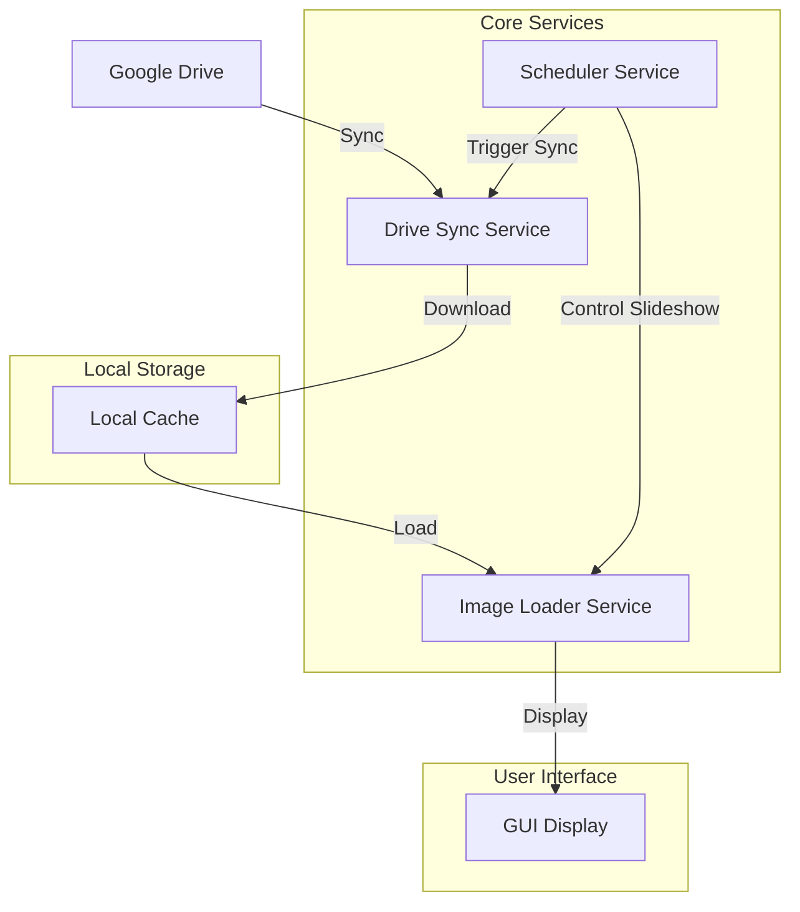

# Smart Picture Display

A Python-based smart picture display application that syncs with Google Drive and creates an automated slideshow of your images.

## Features

- 🔄 Automatic synchronization with Google Drive
- 🖼️ Smooth image slideshow functionality
- 💾 Local caching for optimal performance
- 🎯 Smart storage management
- 🖥️ Adaptive display settings
- 📁 Support for multiple image formats (JPG, JPEG, PNG, GIF, BMP)

## System Architecture



## Setup Instructions

1. Clone the repository
2. Install dependencies:
   ```bash
   pip install -r requirements.txt
   ```
3. Set up Google Drive API credentials:
   - Create a project in Google Cloud Console
   - Enable Drive API
   - Download credentials.json and place it in the project root
4. Run the application:
   ```bash
   python -m smart_picture_display
   ```

## Configuration

Key settings can be modified in `config.py`:

- `SLIDESHOW_INTERVAL`: Time between image transitions (default: 5 seconds)
- `SYNC_INTERVAL`: Drive sync frequency (default: 10 minutes)
- `MAX_STORAGE_PERCENT`: Maximum local storage usage (default: 50%)
- `DRIVE_FOLDER_ID`: Target Google Drive folder for syncing

## Directory Structure

```
smart_picture_display/
├── gui/            # User interface components
├── services/       # Core services
│   ├── drive_sync.py   # Google Drive synchronization
│   ├── image_loader.py # Image loading and processing
│   └── scheduler.py    # Task scheduling
├── utils/          # Utility functions
└── config.py       # Application configuration
```

## Requirements

- Python 3.7+
- Google Drive API credentials
- Internet connection for sync
- Sufficient local storage

## License

[Add your license information here]

## Contributing

Contributions are welcome! Please feel free to submit a Pull Request.
